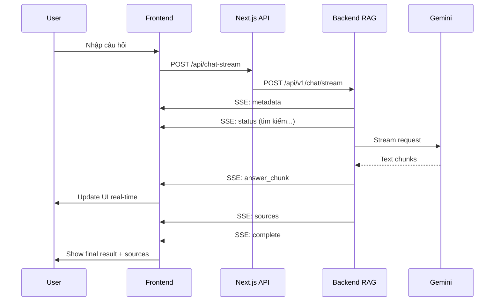

# 🚀 Streaming Chat Implementation

## ✅ Đã hoàn thành

Đã thành công implement streaming chat cho hệ thống với các tính năng:

### 🎯 Backend Streaming (Đã có sẵn)
- ✅ `/api/v1/chat/stream` endpoint với Server-Sent Events (SSE)
- ✅ RAG service với `generate_answer_stream()` method
- ✅ Gemini streaming integration 
- ✅ Real-time progress updates

### 🎯 Frontend Streaming (Vừa implement)
- ✅ `/api/chat-stream` Next.js route proxy đến backend
- ✅ ChatInterface với streaming UI
- ✅ Real-time typing effects
- ✅ SSE parser utilities
- ✅ Dynamic status messages

## 🚀 Cách sử dụng

### 1. Start Backend
```bash
cd uni_bot
python scripts/run_server.py
# Backend sẽ chạy ở http://localhost:8000
```

### 2. Start Frontend  
```bash
cd frontend
npm run dev
# Frontend sẽ chạy ở http://localhost:3000
```

### 3. Test Streaming
1. Vào http://localhost:3000/chat-bot
2. Nhập câu hỏi bất kỳ
3. Quan sát:
   - Spinning icon khi đang stream
   - Status messages (🔍 "Đang tìm kiếm tài liệu liên quan...")
   - Text xuất hiện real-time
   - Sources/feedback hiển thị sau khi hoàn thành

## 🔧 Tính năng Streaming

### Real-time Updates
- **Metadata**: Conversation ID, processing status
- **Status**: "Đang tìm kiếm tài liệu liên quan..."
- **Answer chunks**: Text streaming từng chunk
- **Sources**: Tài liệu tham khảo
- **Complete**: Hoàn thành với attachments, charts

### UI/UX Improvements  
- 🔄 Spinning loader icon cho streaming messages
- 💬 Typing indicator với animated dots
- 📊 Dynamic status messages
- ⚡ Instant text updates
- 🎯 Sources chỉ hiện sau khi hoàn thành

### Error Handling
- ❌ Graceful error handling
- ⏱️ Timeout protection
- 🔄 Fallback to regular response
- 📝 User-friendly error messages

## 📁 Files Changed/Added

### Added:
- `frontend/src/app/api/chat-stream/route.ts` - Next.js streaming proxy
- `frontend/src/utils/sseUtils.ts` - SSE parsing utilities

### Modified:
- `frontend/src/components/ChatInterface.tsx` - Streaming UI implementation

### Existing (Unchanged):
- `src/services/rag_service.py` - Backend streaming logic  
- `src/api/routes.py` - Backend streaming endpoint
- `src/services/gemini_service.py` - Gemini streaming

## 🔄 Luồng hoạt động



## 🎯 Kết quả

- ✅ **User Experience**: Smooth real-time chat như ChatGPT
- ✅ **Performance**: Immediate response, không cần chờ
- ✅ **Reliability**: Error handling và fallback
- ✅ **Maintainability**: Clean code structure với SSE utils
- ✅ **Scalability**: Ready for production

Hệ thống đã sẵn sàng cho production với streaming chat hoàn chỉnh! 🎉