# 📊 BIỂU ĐỒ HỆ THỐNG CHATBOT HỖ TRỢ TƯ VẤN TUYỂN SINH

> Tài liệu này chứa tất cả các biểu đồ minh họa cho bài NCKH

---

## 📑 MỤC LỤC BIỂU ĐỒ

1. [Kiến trúc RAG Overview](#1-kiến-trúc-rag-overview)
2. [Kiến trúc 3 tầng (3-Tier Architecture)](#2-kiến-trúc-3-tầng-3-tier-architecture)
3. [Component Diagram](#3-component-diagram)
4. [Luồng truy vấn người dùng (User Query Sequence)](#4-luồng-truy-vấn-người-dùng)
5. [Luồng Ingest tài liệu (Document Ingestion)](#5-luồng-ingest-tài-liệu)
6. [Quy trình xử lý tài liệu (Document Processing Pipeline)](#6-quy-trình-xử-lý-tài-liệu)
7. [RAG Retrieval Pipeline](#7-rag-retrieval-pipeline)
8. [Hybrid Search Fusion](#8-hybrid-search-fusion)
9. [Bi-Encoder vs Cross-Encoder](#9-bi-encoder-vs-cross-encoder)
10. [JWT Authentication Flow](#10-jwt-authentication-flow)
11. [Security Middleware Flow](#11-security-middleware-flow)
12. [Use Case Diagram](#12-use-case-diagram)
13. [User Journey - Chatbot](#13-user-journey---chatbot)
14. [Admin Workflow](#14-admin-workflow)

---

## 1. Kiến trúc RAG Overview

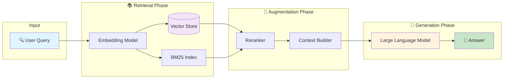

---

## 2. Kiến trúc 3 tầng (3-Tier Architecture)

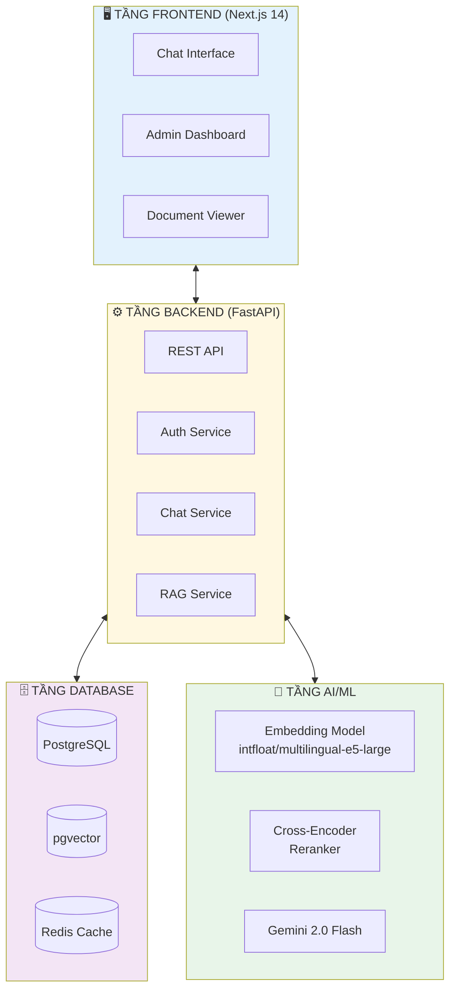

---

## 3. Component Diagram

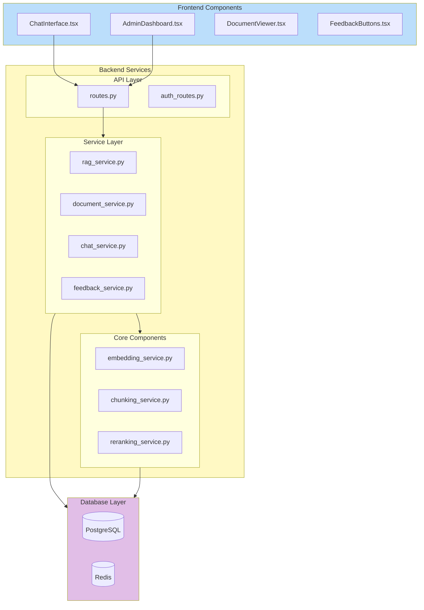

---

## 4. Luồng truy vấn người dùng

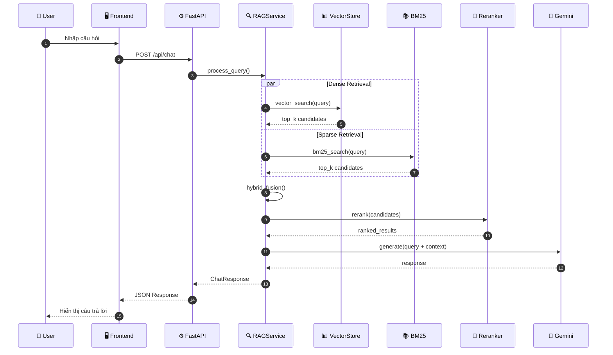

---

## 5. Luồng Ingest tài liệu

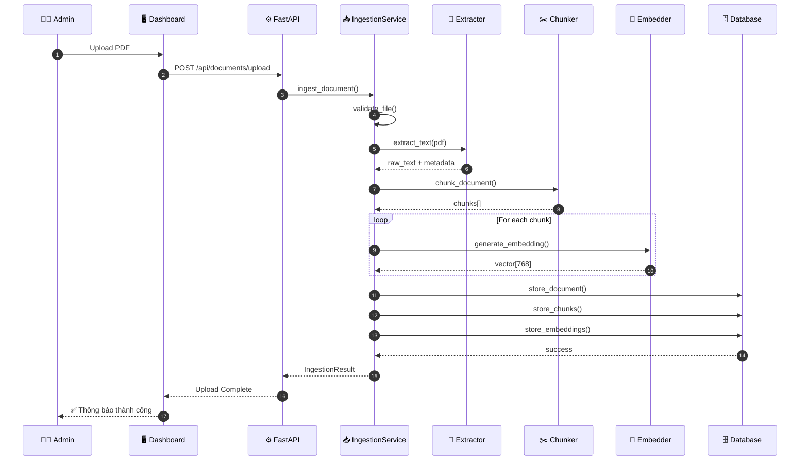

---

## 6. Quy trình xử lý tài liệu

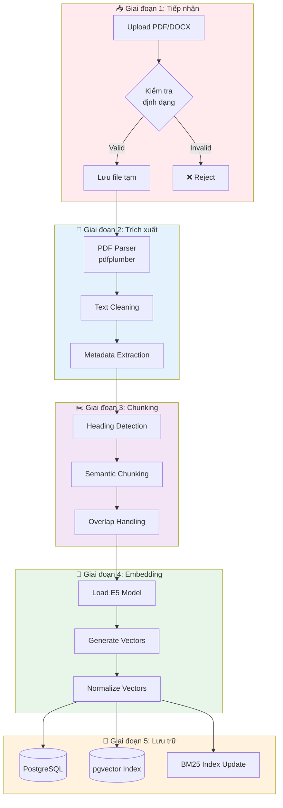

---

## 7. RAG Retrieval Pipeline

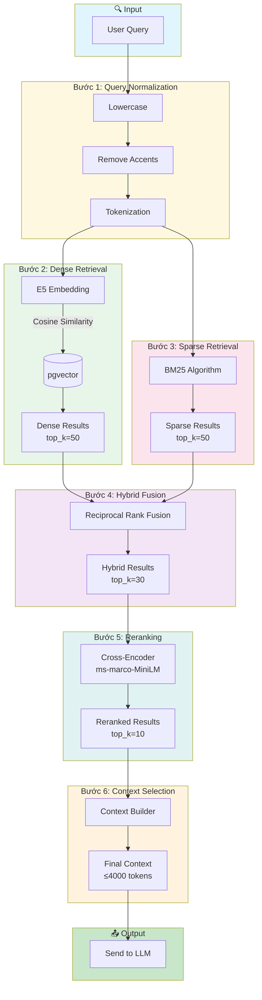

---

## 8. Hybrid Search Fusion

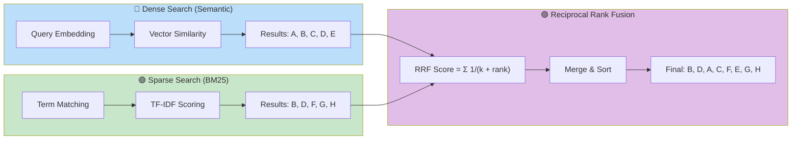

### Công thức RRF:

$$RRF(d) = \sum_{r \in R} \frac{1}{k + r(d)}$$

Trong đó:
- $d$ = document
- $R$ = tập các ranking lists
- $r(d)$ = rank của document d trong list r
- $k$ = constant (thường = 60)

---

## 9. Bi-Encoder vs Cross-Encoder

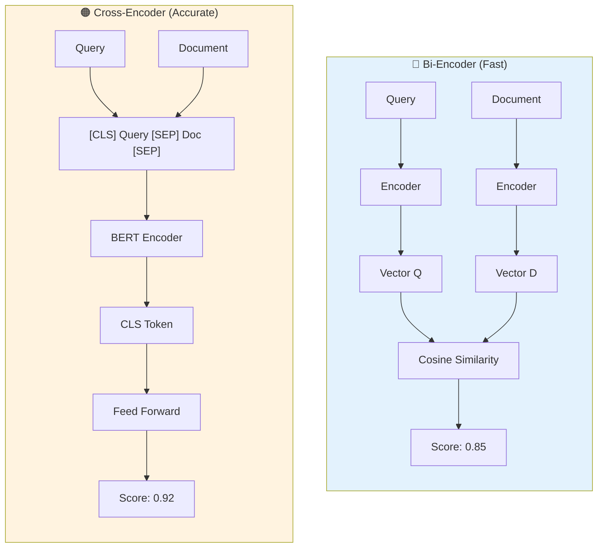

### So sánh:

| Tiêu chí | Bi-Encoder | Cross-Encoder |
|----------|------------|---------------|
| **Tốc độ** | ⚡ Rất nhanh | 🐢 Chậm |
| **Độ chính xác** | Tốt | Xuất sắc |
| **Use case** | Initial retrieval | Reranking |
| **Candidates** | 1000+ docs | 10-50 docs |

---

## 10. JWT Authentication Flow

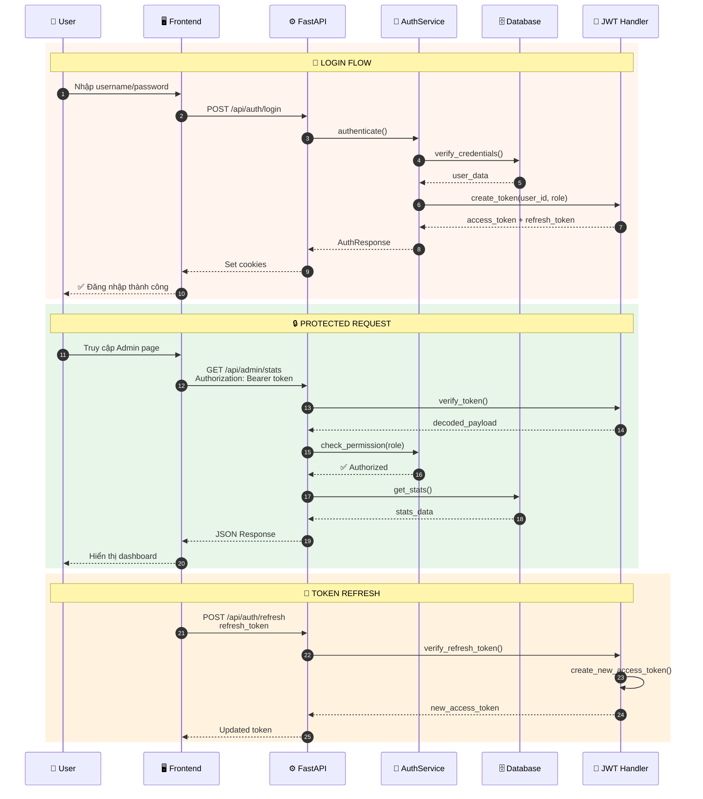

---

## 11. Security Middleware Flow

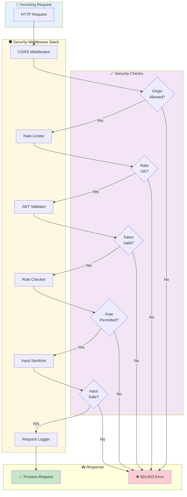

---

## 12. Use Case Diagram

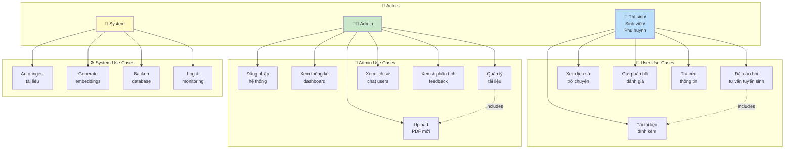

---

## 13. User Journey - Chatbot

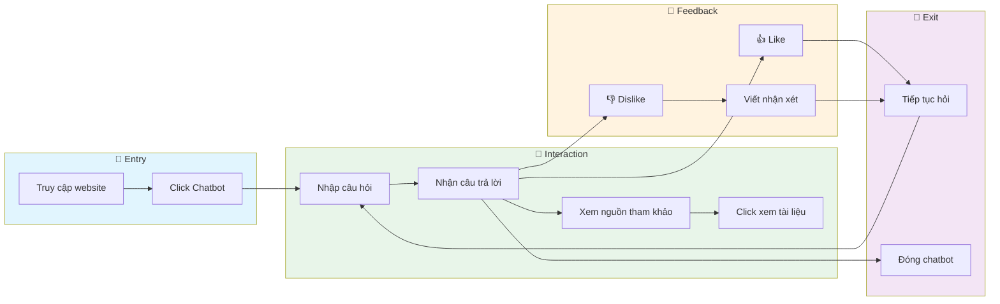

---

## 14. Admin Workflow

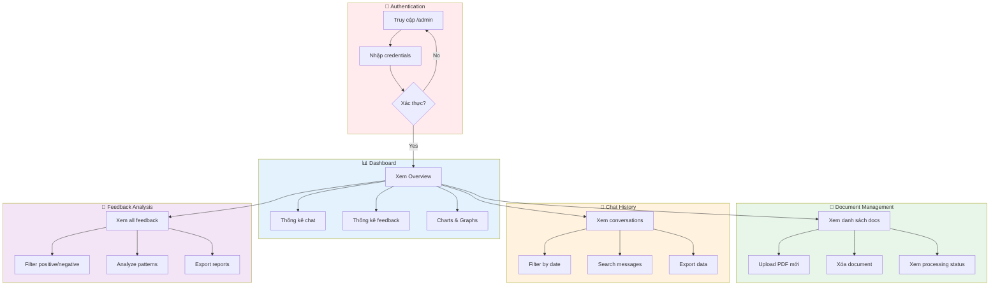

---

## 📌 Hướng dẫn sử dụng

### Xem biểu đồ Mermaid:

1. **VS Code**: Cài extension "Markdown Preview Mermaid Support"
2. **GitHub**: Tự động render khi push lên repo
3. **Online**: Copy code vào [Mermaid Live Editor](https://mermaid.live/)

### Export sang hình ảnh:

1. Truy cập https://mermaid.live/
2. Paste code Mermaid
3. Click "Export" → PNG/SVG

---

## 📚 Tài liệu tham khảo

- [Mermaid Documentation](https://mermaid.js.org/intro/)
- [PlantUML](https://plantuml.com/)
- [Draw.io](https://app.diagrams.net/)

---

*Tài liệu được tạo tự động - Cập nhật: December 2024*
