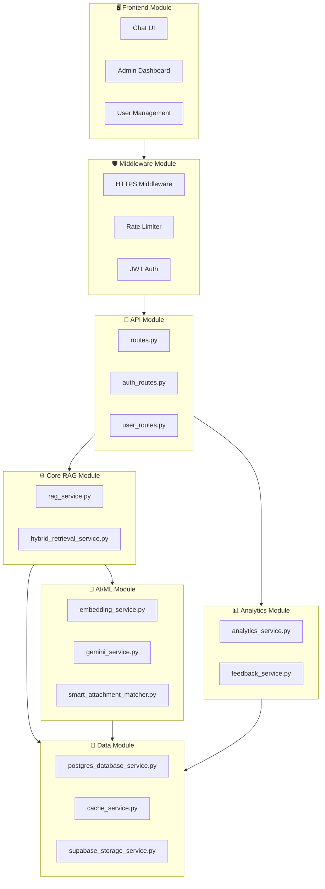

# 4.2 THIẾT KẾ MODULE/CHỨC NĂNG

## MỤC LỤC

1. [Tổng quan Kiến trúc Module](#1-tổng-quan-kiến-trúc-module)
2. [Chi tiết các Module](#2-chi-tiết-các-module)
   - [2.1. Module Core - RAG Engine](#21-module-core---rag-engine)
   - [2.2. Module AI/ML Services](#22-module-aiml-services)
   - [2.3. Module Database & Storage](#23-module-database--storage)
   - [2.4. Module Authentication & Authorization](#24-module-authentication--authorization)
   - [2.5. Module API & Routes](#25-module-api--routes)
   - [2.6. Module Frontend](#26-module-frontend)
   - [2.7. Module Middleware & Security](#27-module-middleware--security)
   - [2.8. Module Analytics & Monitoring](#28-module-analytics--monitoring)
3. [Sơ đồ liên kết Module](#3-sơ-đồ-liên-kết-module)
4. [Ma trận chức năng](#4-ma-trận-chức-năng)

---

## 1. TỔNG QUAN KIẾN TRÚC MODULE

Hệ thống **University Chatbot - PUS** được thiết kế theo kiến trúc **Microservices-Ready Monolith**, chia thành các module độc lập với trách nhiệm rõ ràng:

```
┌────────────────────────────────────────────────────────────────────┐
│                         PRESENTATION LAYER                          │
│   ┌─────────────────────────────────────────────────────────────┐  │
│   │             Frontend (Next.js 15 + React 19)                │  │
│   │   • Chat UI • Admin Dashboard • User Management             │  │
│   └─────────────────────────────────────────────────────────────┘  │
└────────────────────────────────────────────────────────────────────┘
                                  │ HTTP/HTTPS
┌────────────────────────────────────────────────────────────────────┐
│                        APPLICATION LAYER                            │
│   ┌──────────────┐  ┌──────────────┐  ┌────────────────────────┐  │
│   │   API Routes │  │  Middleware  │  │    Authentication      │  │
│   │  (FastAPI)   │  │  (Security)  │  │    (JWT + RBAC)        │  │
│   └──────────────┘  └──────────────┘  └────────────────────────┘  │
└────────────────────────────────────────────────────────────────────┘
                                  │
┌────────────────────────────────────────────────────────────────────┐
│                         SERVICE LAYER                               │
│   ┌──────────────────────────────────────────────────────────────┐ │
│   │                    RAG Engine (Core)                         │ │
│   │  • Hybrid Retrieval • Reranking • Context Building          │ │
│   └──────────────────────────────────────────────────────────────┘ │
│   ┌──────────┐  ┌──────────┐  ┌──────────┐  ┌─────────────────┐  │
│   │ Embedding│  │  Gemini  │  │  Cache   │  │   Attachment    │  │
│   │ Service  │  │  Service │  │  Service │  │   Matcher       │  │
│   └──────────┘  └──────────┘  └──────────┘  └─────────────────┘  │
└────────────────────────────────────────────────────────────────────┘
                                  │
┌────────────────────────────────────────────────────────────────────┐
│                          DATA LAYER                                 │
│   ┌────────────────┐  ┌───────────────┐  ┌─────────────────────┐  │
│   │   PostgreSQL   │  │     Redis     │  │  Supabase Storage   │  │
│   │   + pgvector   │  │    (Cache)    │  │    (Files/PDFs)     │  │
│   └────────────────┘  └───────────────┘  └─────────────────────┘  │
└────────────────────────────────────────────────────────────────────┘
```

---

## 2. CHI TIẾT CÁC MODULE

### 2.1. Module Core - RAG Engine

**Mục đích:** Trái tim của hệ thống - triển khai pipeline Retrieval-Augmented Generation.

| File | Chức năng | Mô tả chi tiết |
|------|-----------|----------------|
| `rag_service.py` | **RAG Orchestrator** | Điều phối toàn bộ luồng RAG: normalization → retrieval → reranking → generation. Xử lý context building và response formatting |
| `async_rag_service.py` | **Async RAG** | Phiên bản bất đồng bộ của RAG service, tối ưu cho high-concurrency |
| `hybrid_retrieval_service.py` | **Hybrid Search** | Kết hợp Dense (vector) + Sparse (BM25) retrieval với công thức RRF fusion (α=0.7) |

**Luồng xử lý RAG:**
```
User Query
    │
    ▼
┌──────────────────────────────────────┐
│ 1. Question Normalization (Gemini)   │
│    "cho tôi form xin nghỉ đi"        │
│    → "form xin nghỉ học"             │
└──────────────────────────────────────┘
    │
    ▼
┌──────────────────────────────────────┐
│ 2. Embedding Generation (SBERT)      │
│    → [0.23, -0.15, ..., 0.67]       │
└──────────────────────────────────────┘
    │
    ▼
┌──────────────────────────────────────┐
│ 3. Hybrid Retrieval                  │
│    Dense (pgvector) + BM25           │
│    → Top 20 candidates               │
└──────────────────────────────────────┘
    │
    ▼
┌──────────────────────────────────────┐
│ 4. Cross-Encoder Reranking           │
│    → Top 5 most relevant             │
└──────────────────────────────────────┘
    │
    ▼
┌──────────────────────────────────────┐
│ 5. Context Assembly + LLM Generation │
│    → Answer with Citations           │
└──────────────────────────────────────┘
    │
    ▼
┌──────────────────────────────────────┐
│ 6. Attachment Matching               │
│    → Related forms/documents         │
└──────────────────────────────────────┘
    │
    ▼
Final Response + Sources
```

---

### 2.2. Module AI/ML Services

**Mục đích:** Cung cấp các dịch vụ AI/ML cho embedding, LLM generation, và semantic matching.

| File | Chức năng | Mô tả chi tiết |
|------|-----------|----------------|
| `embedding_service.py` | **Vector Embedding** | Sử dụng Vietnamese SBERT (`keepitreal/vietnamese-sbert`) để chuyển text → vector 384 chiều. Hỗ trợ batch processing |
| `gemini_service.py` | **LLM Service** | Tích hợp Google Gemini 2.0 Flash cho question normalization, answer generation, và suggested questions |
| `async_gemini_service.py` | **Async LLM** | Phiên bản async của Gemini service với HTTP client pooling |
| `ollama_service.py` | **Local LLM** | Alternative LLM sử dụng Ollama (llama3, qwen2.5) cho môi trường offline |
| `smart_attachment_matcher.py` | **Attachment Matching** | Tự động đề xuất forms/documents dựa trên keyword matching và chunk linking |

**Cấu hình Embedding:**
```python
Model: keepitreal/vietnamese-sbert
Dimension: 384
Language: Vietnamese optimized
Similarity: Cosine distance
```

**Cấu hình LLM:**
```python
Provider: Google Gemini
Model: gemini-2.0-flash
Context Window: 1M tokens
Max Output: 8192 tokens
Temperature: 0.7 (configurable)
```

---

### 2.3. Module Database & Storage

**Mục đích:** Quản lý persistence layer, vector storage, và file storage.

| File | Chức năng | Mô tả chi tiết |
|------|-----------|----------------|
| `postgres_database_service.py` | **Database ORM** | CRUD operations cho documents, chunks, embeddings, attachments. Sử dụng SQLAlchemy + psycopg2 |
| `async_postgres_database_service.py` | **Async Database** | Phiên bản async với asyncpg, connection pooling, và prepared statements |
| `database_service.py` | **Legacy Database** | SQLite-based service (legacy, deprecated) |
| `faiss_service.py` | **Vector Index** | FAISS IVFFlat index cho vector similarity search |
| `supabase_storage_service.py` | **File Storage** | Upload/download files tới Supabase Storage buckets |
| `cache_service.py` | **Redis Caching** | Multi-level caching cho embeddings, queries, và responses |

**Database Schema chính:**

```sql
-- Documents table
documents (id, filename, file_path, file_size, total_chunks, status, is_active, created_at)

-- Chunks table  
chunks (id, document_id, content, chunk_index, heading, metadata, is_active)

-- Embeddings table (pgvector)
embeddings (id, chunk_id, embedding VECTOR(384))

-- Attachments
document_attachments (id, file_name, file_type, file_path, description, keywords[], is_active)

-- Chunk-Attachment linking
chunk_attachments (chunk_id, attachment_id, relevance_score)
```

**Cache Strategy:**
```
L1: GPU/Model Memory (embeddings model)
L2: Redis (query results, user sessions)
L3: PostgreSQL (permanent storage)

TTL: 24 hours (configurable)
Cache Hit Target: 80%+
```

---

### 2.4. Module Authentication & Authorization

**Mục đích:** Xác thực người dùng và phân quyền truy cập.

| File | Chức năng | Mô tả chi tiết |
|------|-----------|----------------|
| `src/auth/jwt_handler.py` | **JWT Manager** | Tạo và verify JWT tokens với HS256 algorithm |
| `src/auth/dependencies.py` | **Auth Dependencies** | FastAPI dependencies cho route protection |
| `src/auth/password_handler.py` | **Password Hashing** | Bcrypt hashing với salt rounds |
| `user_service.py` | **User Management** | CRUD users, role assignment, password change |
| `async_user_service.py` | **Async User Service** | Phiên bản async cho user operations |

**Roles & Permissions:**

| Role | Permissions | Mô tả |
|------|-------------|-------|
| `admin` | ALL | Full system access, user management |
| `user` | READ, CHAT | Chat access, view documents |
| `guest` | LIMITED | View-only, limited queries |

**JWT Token Structure:**
```json
{
  "sub": "user_id",
  "username": "string",
  "roles": ["admin", "user"],
  "exp": 1234567890,
  "iat": 1234567800
}
```

---

### 2.5. Module API & Routes

**Mục đích:** Định nghĩa HTTP endpoints và request/response handling.

| File | Chức năng | Mô tả chi tiết |
|------|-----------|----------------|
| `routes.py` | **Main Routes** | Core API: `/chat`, `/search`, `/documents`, `/chunks`, `/attachments`, `/analytics`, `/upload` |
| `auth_routes.py` | **Auth Routes** | `/login`, `/token`, `/logout` |
| `user_routes.py` | **User Routes** | `/users/me`, `/users/change-password`, `/admin/users` |
| `thammuu_routes.py` | **Custom Routes** | Các routes đặc thù cho nghiệp vụ |

**API Endpoints chính:**

| Endpoint | Method | Auth | Mô tả |
|----------|--------|------|-------|
| `/api/v1/chat` | POST | User | Chat với AI, streaming response |
| `/api/v1/chat/stream` | POST | User | Server-Sent Events streaming |
| `/api/v1/search` | POST | User | Semantic search documents |
| `/api/v1/documents` | GET | Admin | List all documents |
| `/api/v1/documents/upload` | POST | Admin | Upload PDF |
| `/api/v1/chunks` | GET | Admin | List all chunks |
| `/api/v1/attachments` | GET/POST | Admin | Manage attachments |
| `/api/v1/analytics/queries` | GET | Admin | Query analytics |
| `/api/v1/analytics/export` | POST | Admin | Export to Excel |
| `/health` | GET | Public | Health check |

---

### 2.6. Module Frontend

**Mục đích:** Giao diện người dùng web application.

| Component | Chức năng | Mô tả chi tiết |
|-----------|-----------|----------------|
| **Chat UI** | `/` | Interface chat chính với markdown rendering, code highlighting |
| **Admin Dashboard** | `/admin` | Quản lý tổng quan hệ thống |
| **Documents Page** | `/admin/documents` | Upload, view, delete documents |
| **Chunks Page** | `/admin/chunks` | View và edit text chunks |
| **Attachments Page** | `/admin/attachments` | Upload forms, link to chunks |
| **Analytics Page** | `/admin/analytics` | Charts, metrics, export data |
| **Feedback Page** | `/admin/feedback` | User feedback management |
| **User Management** | `/admin/users` | CRUD users, roles |
| **Login Page** | `/login` | Authentication |

**Tech Stack Frontend:**
```
Framework: Next.js 15 (App Router)
UI Library: React 19
Styling: Tailwind CSS
Charts: Recharts
HTTP Client: Fetch API with SSE support
State: React Context + Hooks
```

---

### 2.7. Module Middleware & Security

**Mục đích:** Cross-cutting concerns cho security, logging, và request processing.

| File | Chức năng | Mô tả chi tiết |
|------|-----------|----------------|
| `https_middleware.py` | **HTTPS Redirect** | Force HTTPS trong production, security headers (X-Frame-Options, CSP) |
| `checksum_middleware.py` | **Integrity Check** | Validate request body integrity |
| `rate_limit_middleware.py` | **Rate Limiting** | Throttle requests per IP (100/minute default) |

**Security Features:**
```
✅ HTTPS enforcement (production)
✅ CORS policy with allowed origins
✅ JWT token validation
✅ RBAC (Role-Based Access Control)
✅ SQL injection prevention (parameterized queries)
✅ XSS prevention (input sanitization)
✅ Rate limiting
✅ Security headers (CSP, X-Frame-Options, etc.)
✅ File upload validation (size, type whitelist)
```

---

### 2.8. Module Analytics & Monitoring

**Mục đích:** Thu thập và phân tích dữ liệu sử dụng hệ thống.

| File | Chức năng | Mô tả chi tiết |
|------|-----------|----------------|
| `analytics_service.py` | **Analytics Core** | Track queries, calculate metrics, aggregate statistics |
| `feedback_service.py` | **Feedback Manager** | User feedback (thumbs up/down), sentiment analysis |
| `memory_service.py` | **Conversation Memory** | Store and retrieve conversation history |

**Metrics Tracked:**

| Metric | Mô tả | Aggregation |
|--------|-------|-------------|
| Total Queries | Tổng số câu hỏi | Count, daily/weekly/monthly |
| Avg Confidence | Độ tin cậy trung bình | Average per period |
| Response Time | Thời gian phản hồi | P50, P95, P99 |
| Popular Queries | Câu hỏi phổ biến | Top 10 by frequency |
| Document Usage | Tài liệu được truy xuất | Count per document |
| User Feedback | Đánh giá negative/positive | Count, percentage |
| Cache Hit Rate | Tỷ lệ cache hit | Percentage |

---

## 3. SƠ ĐỒ LIÊN KẾT MODULE



---

## 4. MA TRẬN CHỨC NĂNG

### 4.1. Chức năng theo Role

| Chức năng | Guest | User | Admin |
|-----------|:-----:|:----:|:-----:|
| Chat với AI | ❌ | ✅ | ✅ |
| Xem lịch sử chat | ❌ | ✅ | ✅ |
| Tải forms/attachments | ❌ | ✅ | ✅ |
| Upload PDF documents | ❌ | ❌ | ✅ |
| Quản lý chunks | ❌ | ❌ | ✅ |
| Quản lý attachments | ❌ | ❌ | ✅ |
| Xem analytics | ❌ | ❌ | ✅ |
| Export data | ❌ | ❌ | ✅ |
| Quản lý users | ❌ | ❌ | ✅ |
| Xem feedback | ❌ | ❌ | ✅ |

### 4.2. Dependency Matrix

| Module | Depends On | Used By |
|--------|------------|---------|
| RAG Engine | Embedding, Gemini, Database, Cache | API Routes |
| Embedding Service | HuggingFace Models, Cache | RAG Engine |
| Gemini Service | Google API | RAG Engine, Routes |
| Database Service | PostgreSQL, pgvector | RAG, Analytics, User |
| Cache Service | Redis | Embedding, RAG, Auth |
| Auth Module | JWT, User Service | All Protected Routes |
| Analytics | Database | Admin Routes |
| Frontend | API Layer | (External) |

---

## TỔNG KẾT

Hệ thống **University Chatbot - PUS** bao gồm **8 module chính** với **35+ service files**, cung cấp:

- 🤖 **RAG Engine**: Pipeline AI hoàn chỉnh với hybrid retrieval và reranking
- 🔐 **Security**: JWT authentication, RBAC, và multiple middleware layers
- 📊 **Analytics**: Tracking và phân tích toàn diện
- 🖥️ **Frontend**: Modern UI với Next.js 15 và Tailwind CSS
- 💾 **Storage**: Multi-layer persistence với PostgreSQL, Redis, Supabase
- 🚀 **Performance**: Async services, caching, connection pooling

**Kiến trúc linh hoạt** cho phép dễ dàng mở rộng và bảo trì từng module độc lập.
