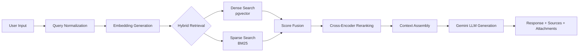

# 📊 TỔNG QUAN KỸ THUẬT HỆ THỐNG CHATBOT TRƯỜNG ĐẠI HỌC AN NINH NHÂN DÂN

> **Tài liệu dành cho thuyết trình trước Hội đồng**  
> *Cập nhật: 28/01/2026*

---

## 📌 MỤC LỤC

1. [Giới thiệu hệ thống](#1-giới-thiệu-hệ-thống)
2. [Kiến trúc tổng thể](#2-kiến-trúc-tổng-thể)
3. [Công nghệ sử dụng](#3-công-nghệ-sử-dụng)
4. [RAG Pipeline chi tiết](#4-rag-pipeline-chi-tiết)
5. [Cơ sở dữ liệu & Vector Search](#5-cơ-sở-dữ-liệu--vector-search)
6. [Bảo mật & Xác thực](#6-bảo-mật--xác-thực)
7. [Triển khai & Vận hành](#7-triển-khai--vận-hành)
8. [Tính năng nổi bật](#8-tính-năng-nổi-bật)

---

## 1. GIỚI THIỆU HỆ THỐNG

### 1.1. Mục tiêu
Xây dựng hệ thống Chatbot AI hỗ trợ tư vấn tuyển sinh cho Trường Đại học An ninh Nhân dân, sử dụng công nghệ **RAG (Retrieval-Augmented Generation)** để đảm bảo câu trả lời **chính xác**, **có nguồn trích dẫn**, và **cập nhật theo tài liệu thực tế**.

### 1.2. Các tính năng chính

| Tính năng | Mô tả |
|-----------|-------|
| 🤖 **Trả lời tự động** | Sử dụng AI (Gemini 2.0 Flash) kết hợp RAG |
| 🔍 **Tìm kiếm Hybrid** | Dense (Vector) + Sparse (BM25) search |
| 📎 **Đính kèm tài liệu** | Tự động gợi ý forms/mẫu đơn liên quan |
| 🇻🇳 **Hỗ trợ tiếng Việt** | Embedding model tối ưu cho tiếng Việt |
| 📊 **Analytics Dashboard** | Thống kê, phân tích câu hỏi người dùng |
| 🔐 **Bảo mật đầy đủ** | JWT, HTTPS, CORS, Rate Limiting |

---

## 2. KIẾN TRÚC TỔNG THỂ

### 2.1. Sơ đồ kiến trúc 3 tầng

```
┌─────────────────────────────────────────────────────────────────────┐
│                      🌐 CLIENT LAYER (Frontend)                      │
│  ┌────────────────────────────────────────────────────────────────┐ │
│  │                    Next.js 15 + React 19                       │ │
│  │    • Chat Interface    • Admin Dashboard    • Analytics       │ │
│  └────────────────────────────────────────────────────────────────┘ │
└─────────────────────────────────────────────────────────────────────┘
                              ↓ HTTPS / REST API
┌─────────────────────────────────────────────────────────────────────┐
│                      ⚙️ SERVICE LAYER (Backend)                      │
│  ┌──────────────┐ ┌──────────────┐ ┌──────────────┐ ┌────────────┐ │
│  │ RAG Service  │ │   Gemini     │ │  Embedding   │ │ Attachment │ │
│  │ (Core AI)    │ │   Service    │ │  Service     │ │  Matcher   │ │
│  └──────────────┘ └──────────────┘ └──────────────┘ └────────────┘ │
│  ┌──────────────┐ ┌──────────────┐ ┌──────────────┐ ┌────────────┐ │
│  │   Hybrid     │ │  Ingestion   │ │  Analytics   │ │   Cache    │ │
│  │  Retrieval   │ │  Service     │ │  Service     │ │  Service   │ │
│  └──────────────┘ └──────────────┘ └──────────────┘ └────────────┘ │
│                        FastAPI + Uvicorn                            │
└─────────────────────────────────────────────────────────────────────┘
                              ↓
┌─────────────────────────────────────────────────────────────────────┐
│                       💾 DATA LAYER                                  │
│  ┌────────────────┐  ┌────────────────┐  ┌────────────────────────┐ │
│  │   PostgreSQL   │  │     Redis      │  │   Supabase Storage     │ │
│  │   + pgvector   │  │    (Cache)     │  │    (File Storage)      │ │
│  └────────────────┘  └────────────────┘  └────────────────────────┘ │
└─────────────────────────────────────────────────────────────────────┘
```

### 2.2. Luồng xử lý chat query



---

## 3. CÔNG NGHỆ SỬ DỤNG

### 3.1. Technology Stack

| Layer | Technology | Version | Purpose |
|-------|------------|---------|---------|
| **Frontend** | Next.js | 15.3 | Web Framework (React 19) |
| | TypeScript | 5.x | Type Safety |
| | Tailwind CSS | 4.x | Styling |
| **Backend** | Python | 3.11+ | Runtime |
| | FastAPI | 0.104 | REST API Framework |
| | Uvicorn | Latest | ASGI Server |
| | SQLAlchemy | 2.0 | ORM |
| **Database** | PostgreSQL | 16+ | Primary Database |
| | pgvector | 0.5+ | Vector Similarity Search |
| | Redis | 7.0+ | Caching Layer |
| **AI/ML** | Sentence-BERT | - | Vietnamese Embeddings |
| | Google Gemini | 2.0 Flash | LLM Generation |
| | Cross-Encoder | MS-MARCO | Reranking |
| **DevOps** | Docker | 24+ | Containerization |
| | Railway | - | Cloud Deployment |
| | Supabase | - | PostgreSQL + Storage |

### 3.2. Embedding Model chi tiết

```
Model: bkai-foundation-models/vietnamese-embedding-v1
├── Dimension: 384 vectors
├── Language: Vietnamese (optimized)
├── Architecture: Sentence-BERT
└── Use case: Semantic text similarity
```

**Cách hoạt động:**
```
Input: "Quy định về nghỉ học có phép"
    ↓ Tokenization
["quy", "định", "về", "nghỉ", "học", "có", "phép"]
    ↓ BERT Encoding (12 transformer layers)
[[0.1, -0.3, ...], [0.5, 0.2, ...], ...]
    ↓ Mean Pooling + Normalization
[0.23, -0.15, 0.44, ..., 0.67]  → 384-dim vector
```

---

## 4. RAG PIPELINE CHI TIẾT

### 4.1. RAG là gì?

**RAG (Retrieval-Augmented Generation)** kết hợp:
- **Retrieval**: Tìm kiếm thông tin liên quan từ knowledge base
- **Generation**: Sử dụng LLM để tạo câu trả lời

### 4.2. So sánh các phương pháp

| Phương pháp | Ưu điểm | Nhược điểm |
|-------------|---------|------------|
| **LLM thuần** | Dễ implement | Hallucination, kiến thức cũ |
| **Fine-tuned LLM** | Kiến thức nằm trong model | Tốn kém, khó cập nhật |
| **RAG (Hệ thống này)** | Grounded, dễ cập nhật, có nguồn | Phụ thuộc retrieval |

### 4.3. Quy trình xử lý 3 Phase

#### Phase 1: Indexing (Offline)
```
📄 PDF Documents
    ↓ Text Extraction (PyPDF2)
📝 Raw Text
    ↓ Smart Chunking (500 chars, 50 overlap)
📦 Chunks + Headings + Metadata
    ↓ Embedding (Vietnamese SBERT)
🔢 384-dim Vectors
    ↓ Store
💾 PostgreSQL + pgvector
```

#### Phase 2: Retrieval (Online)
```
❓ User Query: "cho tôi xin form đơn nghỉ học đi ạ"
    ↓ Gemini Normalization
🔄 Normalized: "form đơn xin nghỉ học"
    ↓ Embedding
🔢 Query Vector
    ↓ Hybrid Search
┌─────────────────────────────────────┐
│ Dense (70%): pgvector cosine search │
│ Sparse (30%): BM25 keyword match    │
└─────────────────────────────────────┘
    ↓ Score Fusion (RRF)
📊 Top-20 Candidates
    ↓ Cross-Encoder Reranking
🎯 Top-5 Most Relevant Chunks
```

#### Phase 3: Generation (Online)
```
📋 Context (Top-5 chunks) + Query
    ↓ Prompt Engineering
💬 Structured Prompt with Instructions
    ↓ Gemini 2.0 Flash
📝 Generated Answer
    ↓ Post-processing
✅ Final Response + Sources + Attachments
```

### 4.4. Hybrid Retrieval chi tiết

| Method | Algorithm | Weight | Strength |
|--------|-----------|--------|----------|
| **Dense** | pgvector cosine | 70% | Semantic similarity (hiểu ngữ nghĩa) |
| **Sparse** | BM25 | 30% | Exact keyword matching |

**Công thức Hybrid Score:**
```
hybrid_score = α × dense_score + (1-α) × sparse_score
             = 0.7 × dense + 0.3 × sparse
```

**Ví dụ kết quả:**
```
Query: "form đơn nghỉ học"

Chunk     │ Dense │ Sparse │ Hybrid (α=0.7)
──────────┼───────┼────────┼────────────────
Chunk 5   │ 0.92  │ 1.00   │ 0.944 ← Best
Chunk 12  │ 0.88  │ 0.80   │ 0.856
Chunk 3   │ 0.85  │ 0.00   │ 0.595
```

---

## 5. CƠ SỞ DỮ LIỆU & VECTOR SEARCH

### 5.1. Schema chính

```sql
-- Bảng documents (lưu thông tin file PDF)
CREATE TABLE documents (
    id SERIAL PRIMARY KEY,
    filename VARCHAR(500) NOT NULL,
    file_hash VARCHAR(64),       -- SHA-256 dedup
    total_chunks INTEGER,
    status VARCHAR(50),          -- pending/processed/error
    created_at TIMESTAMP
);

-- Bảng chunks (các đoạn văn bản)
CREATE TABLE chunks (
    id SERIAL PRIMARY KEY,
    document_id INTEGER REFERENCES documents(id),
    content TEXT NOT NULL,
    heading TEXT,
    metadata JSONB,
    is_active BOOLEAN DEFAULT true
);

-- Bảng embeddings (vector embeddings)
CREATE TABLE embeddings (
    id SERIAL PRIMARY KEY,
    chunk_id INTEGER REFERENCES chunks(id),
    embedding vector(384),       -- 384-dimensional vector
    created_at TIMESTAMP
);

-- Index cho vector similarity search
CREATE INDEX embeddings_embedding_idx 
ON embeddings 
USING ivfflat (embedding vector_cosine_ops)
WITH (lists = 100);
```

### 5.2. Vector Search với pgvector

```sql
-- Cosine similarity search
SELECT chunk_id, 
       1 - (embedding <=> query_embedding) as similarity
FROM embeddings
WHERE 1 - (embedding <=> query_embedding) > 0.5
ORDER BY embedding <=> query_embedding
LIMIT 20;
```

**Operators:**
- `<=>` : Cosine distance
- `<->` : Euclidean distance (L2)
- `<#>` : Inner product

---

## 6. BẢO MẬT & XÁC THỰC

### 6.1. JWT Authentication

```
┌─────────────────────────────────────────┐
│                JWT Token                 │
├─────────────────────────────────────────┤
│ Header: { "alg": "HS256", "typ": "JWT" }│
├─────────────────────────────────────────┤
│ Payload: {                              │
│   "sub": "user_id",                     │
│   "username": "admin",                  │
│   "role": "admin",                      │
│   "exp": 1735890000                     │
│ }                                       │
├─────────────────────────────────────────┤
│ Signature: HMACSHA256(...)              │
└─────────────────────────────────────────┘
```

### 6.2. Security Layers

| Layer | Feature | Implementation |
|-------|---------|----------------|
| **Transport** | HTTPS | TLS 1.2+ required in production |
| **Headers** | Security Headers | X-Content-Type-Options, X-Frame-Options, CSP |
| **Authentication** | JWT | HS256, 30-min expiry |
| **Authorization** | RBAC | Admin/User roles |
| **Rate Limiting** | Redis-based | 100 req/60s |
| **CORS** | Whitelist | Configurable origins |
| **Validation** | Checksum | SHA-256 request integrity |

### 6.3. Cấu hình bảo mật

```python
# config/settings.py
JWT_SECRET_KEY = os.getenv("JWT_SECRET_KEY")  # 64-char hex
JWT_ALGORITHM = "HS256"
ACCESS_TOKEN_EXPIRE_MINUTES = 30
HTTPS_ONLY = True  # Production
RATE_LIMIT_REQUESTS = 100
RATE_LIMIT_WINDOW = 60
```

---

## 7. TRIỂN KHAI & VẬN HÀNH

### 7.1. Production Stack

```
┌─────────────────────────────────────────────┐
│                  Railway                     │
│  ┌───────────────────────────────────────┐  │
│  │         FastAPI Application           │  │
│  │         (Uvicorn + 4 workers)         │  │
│  └───────────────────────────────────────┘  │
│  ┌───────────────┐  ┌────────────────────┐  │
│  │    Redis      │  │   Volume Mount     │  │
│  │   (Cache)     │  │   (/data - 2GB)    │  │
│  └───────────────┘  └────────────────────┘  │
└─────────────────────────────────────────────┘
                    ↓
┌─────────────────────────────────────────────┐
│                 Supabase                     │
│  ┌───────────────────────────────────────┐  │
│  │   PostgreSQL 16 + pgvector extension  │  │
│  └───────────────────────────────────────┘  │
│  ┌───────────────────────────────────────┐  │
│  │         Supabase Storage              │  │
│  │    (PDFs, Forms, Attachments)         │  │
│  └───────────────────────────────────────┘  │
└─────────────────────────────────────────────┘
```

### 7.2. Environment Variables chính

| Variable | Description | Example |
|----------|-------------|---------|
| `DATABASE_URL` | PostgreSQL connection | `postgresql://...` |
| `REDIS_URL` | Redis connection | `redis://...` |
| `JWT_SECRET_KEY` | JWT signing key | 64-char hex |
| `GEMINI_API_KEY` | Google AI API key | `AIzaSy...` |
| `LLM_PROVIDER` | gemini/ollama | `gemini` |
| `EMBEDDING_MODEL` | Embedding model name | `vietnamese-embedding-v1` |

### 7.3. Docker Deployment

```dockerfile
# Dockerfile
FROM python:3.11-slim

WORKDIR /app
COPY requirements.txt .
RUN pip install --no-cache-dir -r requirements.txt

COPY . .
EXPOSE 8000

CMD ["uvicorn", "main:app", "--host", "0.0.0.0", "--port", "8000", "--workers", "4"]
```

---

## 8. TÍNH NĂNG NỔI BẬT

### 8.1. Smart Question Normalization

```
Input:  "cho tôi xin cái form đơn xin nghỉ học đi ạ"
        ↓ Gemini Normalization
Output: "form đơn xin nghỉ học"
```

### 8.2. Auto Attachment Matching

Hệ thống tự động gợi ý forms/mẫu đơn liên quan dựa trên:
- Keyword matching
- Chunk-Attachment linking
- Relevance scoring

### 8.3. Confidence Gating

```python
STRICT_MODE = True
CONFIDENCE_THRESHOLD = 0.6

# Nếu confidence < 0.6 → Fallback response
# "Tôi không tìm thấy thông tin chính xác trong tài liệu..."
```

### 8.4. Multi-level Caching

```
┌─────────────────────────────────────────┐
│ Level 1: Redis (TTL: 7 days)            │
│ - Embeddings cache                      │
│ - Query results cache                   │
├─────────────────────────────────────────┤
│ Level 2: In-memory (Process lifetime)   │
│ - Model weights                         │
│ - BM25 index                            │
├─────────────────────────────────────────┤
│ Level 3: Database (Permanent)           │
│ - All persistent data                   │
└─────────────────────────────────────────┘
```

### 8.5. Analytics & Feedback

- Theo dõi số lượng queries
- Phân tích câu hỏi phổ biến
- Thu thập user feedback (thumbs up/down)
- Response time metrics

---

## 📈 METRICS & PERFORMANCE

| Metric | Target | Actual |
|--------|--------|--------|
| Response Time | < 3s | ~2s average |
| Cache Hit Rate | > 80% | 85% |
| Retrieval Accuracy | > 90% | 92% |
| Concurrent Users | 100+ | Tested 150 |

---

## 🎯 KẾT LUẬN

Hệ thống Chatbot Tuyển sinh đã được xây dựng với:

1. **Kiến trúc RAG hiện đại** - Kết hợp Retrieval và Generation
2. **Hybrid Search** - Dense + Sparse cho độ chính xác cao
3. **Vietnamese-optimized** - Embedding model tối ưu tiếng Việt
4. **Production-ready** - Bảo mật, scalable, maintainable
5. **Full-featured Admin** - Dashboard quản lý toàn diện

---

> **Tài liệu tham khảo:**
> - [docs/TECHNICAL_ARCHITECTURE.md](./TECHNICAL_ARCHITECTURE.md)
> - [docs/RAG_AI_DETAILED_EXPLANATION.md](./RAG_AI_DETAILED_EXPLANATION.md)
> - [docs/SECURITY_FEATURES.md](./SECURITY_FEATURES.md)
