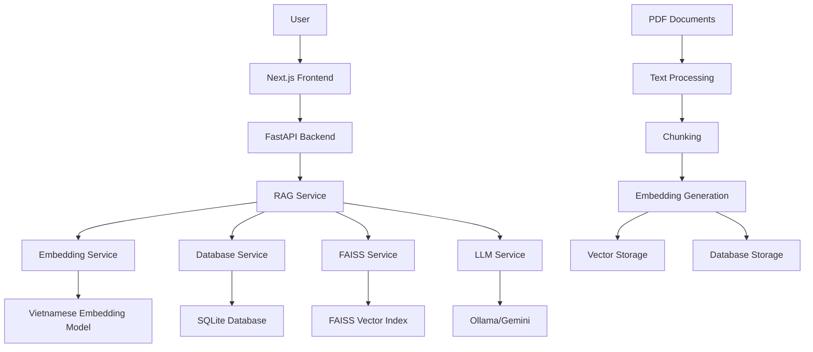
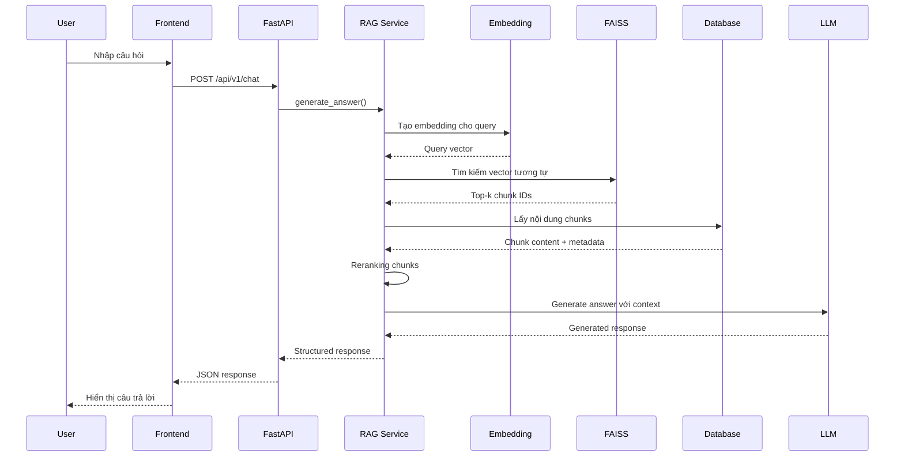

# KIẾN TRÚC HỆ THỐNG CHATBOT TUYỂN SINH AI

## 📋 TỔNG QUAN HỆ THỐNG

Hệ thống Chatbot Tuyển sinh AI là một ứng dụng web thông minh được xây dựng để hỗ trợ tư vấn tuyển sinh cho Trường Đại học An ninh Nhân dân. Hệ thống sử dụng công nghệ RAG (Retrieval-Augmented Generation) kết hợp với AI để cung cấp thông tin chính xác và phù hợp với từng câu hỏi của người dùng.

## 🏗️ KIẾN TRÚC TỔNG THỂ

### Mô hình 3-Tier Architecture

```
┌─────────────────────────────────────────────────────────────┐
│                    PRESENTATION LAYER                        │
│                     (Frontend - Next.js)                    │
├─────────────────────────────────────────────────────────────┤
│                    APPLICATION LAYER                         │
│                    (Backend - FastAPI)                      │
├─────────────────────────────────────────────────────────────┤
│                      DATA LAYER                             │
│              (SQLite + FAISS + Vector DB)                   │
└─────────────────────────────────────────────────────────────┘
```

## 🎯 CÁC THÀNH PHẦN CHÍNH

### 1. Frontend (Next.js + TypeScript)
- **Framework**: Next.js 14 với TypeScript
- **Styling**: TailwindCSS
- **Components**: React Components với Lucide Icons
- **State Management**: React Hooks (useState, useEffect)

### 2. Backend (FastAPI + Python)
- **Framework**: FastAPI
- **Language**: Python 3.11+
- **Architecture**: Microservices pattern
- **API**: RESTful API với OpenAPI documentation

### 3. AI/ML Components
- **LLM Provider**: Ollama (local) hoặc Google Gemini
- **Embedding Model**: Vietnamese Embedding v1
- **Vector Database**: FAISS Index
- **Reranking**: CrossEncoder model

### 4. Data Storage
- **Primary Database**: SQLite
- **Vector Storage**: FAISS Index
- **Document Storage**: PDF files trong thư mục data/

## 🔄 LUỒNG HOẠT ĐỘNG CHI TIẾT

### A. Khởi tạo hệ thống

1. **Backend Startup**:
   ```
   main.py → Load Environment → Initialize FastAPI → Setup CORS → Load Services
   ```

2. **Service Initialization**:
   - `EmbeddingService`: Load Vietnamese embedding model
   - `DatabaseService`: Kết nối SQLite database
   - `RAGService`: Khởi tạo FAISS index và conversation memory
   - `OllamaService`: Kết nối với Ollama server

3. **Frontend Startup**:
   ```
   Next.js App → Load Components → Initialize Chat Interface → Connect to API
   ```

### B. Xử lý câu hỏi của người dùng

#### Bước 1: Nhận input từ người dùng
```
User Input → ChatInterface Component → API Call (/api/v1/chat)
```

#### Bước 2: Xử lý tại Backend
```
FastAPI Router → RAGService.generate_answer() → Các bước xử lý
```

#### Bước 3: Retrieval Process (Tìm kiếm thông tin)
1. **Embedding Generation**:
   ```python
   user_query → EmbeddingService → vector_representation
   ```

2. **Vector Search**:
   ```python
   query_vector → FAISS_search → top_k_similar_chunks
   ```

3. **Database Lookup**:
   ```python
   chunk_ids → SQLite_query → full_chunk_content + metadata
   ```

4. **Reranking**:
   ```python
   retrieved_chunks → CrossEncoder → reranked_results
   ```

#### Bước 4: Generation Process (Tạo câu trả lời)
1. **Context Preparation**:
   ```python
   relevant_chunks + conversation_history → context_prompt
   ```

2. **LLM Generation**:
   ```python
   context_prompt → Ollama/Gemini → generated_answer
   ```

3. **Response Formatting**:
   ```python
   raw_answer → format_response → structured_response
   ```

#### Bước 5: Trả về kết quả
```
Structured Response → FastAPI → JSON Response → Frontend → Display
```

## 📁 CẤU TRÚC THƯ MỤC

```
uni_bot/
├── main.py                 # Entry point của ứng dụng
├── config/
│   └── settings.py         # Cấu hình hệ thống
├── src/
│   ├── api/
│   │   └── routes.py       # API endpoints
│   ├── models/
│   │   └── schemas.py      # Data models
│   ├── services/           # Business logic
│   │   ├── rag_service.py
│   │   ├── embedding_service.py
│   │   ├── database_service.py
│   │   ├── ollama_service.py
│   │   └── gemini_service.py
│   └── utils/              # Utilities
│       ├── logger.py
│       └── text_processing.py
├── frontend/               # Next.js application
│   └── src/
│       ├── app/           # App router
│       ├── components/    # React components
│       └── services/      # API services
└── data/                  # Data storage
    ├── pdfs/             # Source documents
    ├── processed/        # Processed chunks
    └── embeddings/       # Vector indices
```

## 🔧 CÁC DỊCH VỤ CORE

### 1. RAGService (Dịch vụ chính)
**Chức năng**: Điều phối toàn bộ quá trình RAG
- Quản lý conversation history
- Kết hợp retrieval và generation
- Xử lý logic business

### 2. EmbeddingService
**Chức năng**: Chuyển đổi text thành vector
- Load Vietnamese embedding model
- Generate embeddings cho queries và documents
- Caching embeddings

### 3. DatabaseService
**Chức năng**: Quản lý dữ liệu
- CRUD operations với SQLite
- Lưu trữ chunks và metadata
- Quản lý conversation history

### 4. OllamaService / GeminiService
**Chức năng**: Tương tác với LLM
- Gửi prompts tới AI models
- Xử lý responses
- Error handling và retry logic

## 🌐 API ENDPOINTS

### Core Endpoints:
- `POST /api/v1/chat` - Xử lý câu hỏi chính
- `POST /api/v1/search` - Tìm kiếm documents
- `GET /api/v1/health` - Health check
- `GET /api/v1/stats` - Thống kê hệ thống
- `GET /api/v1/conversation/{id}` - Lịch sử hội thoại

## 📊 LUỒNG DỮ LIỆU

### Input Flow:
```
User Question → Frontend → API → RAG Service → Multiple Services → Response
```

### Data Processing Flow:
```
PDF Documents → Text Extraction → Chunking → Embedding → FAISS Index → SQLite
```

### Retrieval Flow:
```
Query → Embedding → FAISS Search → Database Lookup → Reranking → Context
```

### Generation Flow:
```
Context + History → Prompt Engineering → LLM → Post-processing → Response
```

## 🔒 BẢO MẬT VÀ HIỆU SUẤT

### Security Features:
- CORS configuration
- Input validation
- Error handling
- Rate limiting (configurable)

### Performance Optimizations:
- Vector search với FAISS
- Conversation caching
- Lazy loading services
- Async/await patterns

## 🚀 DEPLOYMENT

### Development:
```bash
# Backend
python main.py

# Frontend
cd frontend && npm run dev
```

### Production Considerations:
- Environment variables configuration
- Database optimization
- Vector index optimization
- Load balancing
- Monitoring và logging

## 📈 SƠ ĐỒ LUỒNG XỬ LÝ CHI TIẾT

### Sơ đồ tổng quan hệ thống:


### Luồng xử lý câu hỏi:


## 🔍 CHI TIẾT CÁC THÀNH PHẦN

### Frontend Components:
- **ChatInterface**: Component chính xử lý giao diện chat
- **Layout**: Template layout cho toàn bộ ứng dụng
- **Header/Footer**: Navigation và thông tin
- **API Service**: Xử lý calls tới backend

### Backend Services:
- **RAGService**: Orchestrator chính
- **EmbeddingService**: Xử lý vector embeddings
- **DatabaseService**: Quản lý SQLite operations
- **OllamaService**: Interface với Ollama LLM
- **GeminiService**: Interface với Google Gemini

### Data Flow trong RAG:
1. **Document Ingestion**: PDF → Text → Chunks → Embeddings → Storage
2. **Query Processing**: Question → Embedding → Search → Retrieve → Rank
3. **Answer Generation**: Context + Query → LLM → Response → Format

## 🛠️ CÔNG NGHỆ SỬ DỤNG

### Backend Stack:
- **FastAPI**: Web framework
- **SQLite**: Primary database
- **FAISS**: Vector similarity search
- **Sentence Transformers**: Embedding models
- **CrossEncoder**: Reranking model
- **Ollama**: Local LLM inference
- **Google Gemini**: Cloud LLM service

### Frontend Stack:
- **Next.js 14**: React framework
- **TypeScript**: Type safety
- **TailwindCSS**: Styling
- **Lucide React**: Icons
- **React Markdown**: Markdown rendering

### AI/ML Stack:
- **Vietnamese Embedding v1**: Specialized Vietnamese embeddings
- **CrossEncoder**: Query-document reranking
- **Llama3**: Local language model
- **Gemini 1.5 Flash**: Cloud language model

## 📋 CẤU HÌNH HỆ THỐNG

### Environment Variables:
```env
# LLM Configuration
LLM_PROVIDER=ollama
OLLAMA_BASE_URL=http://localhost:11434
OLLAMA_MODEL=llama3
GEMINI_API_KEY=your_api_key

# Database Configuration
DATABASE_PATH=data/embeddings/chatbot.db
FAISS_INDEX_PATH=data/embeddings/faiss_index

# API Configuration
API_HOST=0.0.0.0
API_PORT=8000

# RAG Configuration
CHUNK_SIZE=500
CHUNK_OVERLAP=50
TOP_K_RESULTS=5
SIMILARITY_THRESHOLD=0.35
```

## 🔄 QUY TRÌNH PHÁT TRIỂN

### 1. Data Preparation:
```bash
# Xử lý PDF documents
python scripts/process_pdfs.py

# Tạo embeddings
python scripts/build_embeddings.py

# Khởi tạo database
python scripts/reset_database.py
```

### 2. Development Workflow:
```bash
# Start backend
python main.py

# Start frontend (terminal mới)
cd frontend && npm run dev

# Test API
curl -X POST "http://localhost:8000/api/v1/chat" \
  -H "Content-Type: application/json" \
  -d '{"message": "Các ngành đào tạo của trường?"}'
```

### 3. Monitoring & Debugging:
- Logs: `logs/chatbot.log`
- Health check: `GET /api/v1/health`
- Stats: `GET /api/v1/stats`
- API docs: `http://localhost:8000/docs`

## 🎯 TÍNH NĂNG CHÍNH

### 1. Intelligent Q&A:
- Hiểu câu hỏi tiếng Việt tự nhiên
- Tìm kiếm thông tin chính xác từ tài liệu
- Tạo câu trả lời phù hợp với context

### 2. Conversation Memory:
- Lưu trữ lịch sử hội thoại
- Context awareness trong cuộc trò chuyện
- Personalized responses

### 3. Multi-source Information:
- Tích hợp nhiều tài liệu PDF
- Metadata tracking
- Source attribution

### 4. Performance Optimization:
- Vector search với FAISS
- Efficient embedding caching
- Async processing

## 🔮 HƯỚNG PHÁT TRIỂN

### Short-term:
- Cải thiện UI/UX
- Thêm tính năng export conversation
- Optimize response time

### Long-term:
- Multi-language support
- Voice interface
- Advanced analytics
- Mobile application
