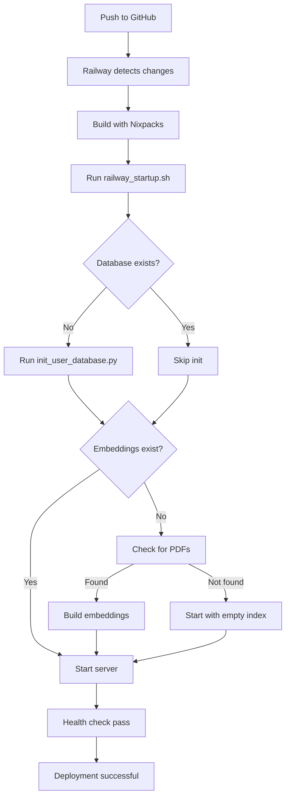

# 🎯 Railway + Supabase Deployment - Implementation Summary

**Date**: 15/01/2026  
**Status**: ✅ Production Ready  
**Target**: Deploy University Chatbot on Railway with Supabase PostgreSQL

---

## 📦 Files Created/Updated

### 1. Documentation
- ✅ **[docs/deployment/RAILWAY_SUPABASE_DEPLOYMENT.md](docs/deployment/RAILWAY_SUPABASE_DEPLOYMENT.md)**
  - Comprehensive deployment guide (10 bước chi tiết)
  - Supabase setup instructions
  - Railway configuration
  - Environment variables
  - Troubleshooting guide
  - Monitoring & backup procedures

- ✅ **[docs/deployment/RAILWAY_QUICK_REFERENCE.md](docs/deployment/RAILWAY_QUICK_REFERENCE.md)**
  - Quick start guide (5 phút)
  - Pre/Post-deploy checklists
  - Common issues & fixes
  - Security hardening commands
  - Monitoring commands

- ✅ **[README.md](README.md)** (Updated)
  - Added Deployment section
  - Railway + Supabase quick deploy checklist
  - Link to detailed guides

### 2. Configuration Files
- ✅ **[.env.railway](.env.railway)**
  - Template environment variables cho Railway
  - Annotated với descriptions
  - Security notes
  - All required variables for Supabase + Redis

- ✅ **[railway.json](railway.json)** (Updated)
  - Changed startCommand to use railway_startup.sh
  - Keeps healthcheck configuration
  - Auto-deployment settings

### 3. Scripts
- ✅ **[railway_startup.sh](railway_startup.sh)**
  - 5-step initialization process:
    1. Environment check
    2. Database connection test
    3. Auto-initialize users table
    4. Check/build embeddings
    5. Start FastAPI server
  - Handles first-time deployment
  - Logs detailed progress

- ✅ **[scripts/verify_railway_connection.py](scripts/verify_railway_connection.py)**
  - Verify DATABASE_URL connectivity
  - Check pgvector extension
  - Test read/write permissions
  - List existing tables
  - Pre-deploy verification tool

- ✅ **[scripts/generate_jwt_secret.py](scripts/generate_jwt_secret.py)**
  - Generate cryptographically secure JWT secret key
  - Output ready-to-use in Railway Variables
  - Generate additional keys (refresh token, encryption)

---

## 🔧 System Requirements Met

### Database (Supabase PostgreSQL)
- ✅ Connection string configuration
- ✅ pgvector extension support
- ✅ SQLAlchemy connection pooling
- ✅ Auto-migration on startup
- ✅ Connection verification script

### Redis (Railway Redis)
- ✅ Auto-configuration via REDIS_URL
- ✅ URL parsing for host/port/password
- ✅ Cache prefix configuration
- ✅ TTL settings

### Storage (Railway Volume)
- ✅ Mount at /data via RAILWAY_VOLUME_MOUNT
- ✅ Auto-create directories (pdfs, embeddings, logs)
- ✅ Persistent embeddings storage
- ✅ PDF watch directory

### Security
- ✅ JWT secret key generation script
- ✅ HTTPS enforcement
- ✅ CORS configuration
- ✅ Default password change procedure
- ✅ Security headers middleware

### LLM Integration
- ✅ Gemini API support (GEMINI_API_KEY)
- ✅ Ollama support (OLLAMA_BASE_URL)
- ✅ Flexible provider configuration

---

## 🚀 Deployment Flow



---

## 📋 Pre-Deployment Checklist

### Supabase Setup
- [ ] Project created on Supabase
- [ ] pgvector extension enabled: `CREATE EXTENSION IF NOT EXISTS vector;`
- [ ] Direct connection URL copied (port 5432, not pooling)
- [ ] Storage bucket created: `chat-attachments`
- [ ] SUPABASE_URL và SUPABASE_SERVICE_KEY noted

### Railway Setup
- [ ] GitHub repo connected
- [ ] Redis service added (Railway auto-provides REDIS_URL)
- [ ] Volume created và mounted at `/data` (2GB+ recommended)
- [ ] Environment variables set from `.env.railway` template

### Critical Environment Variables
- [ ] `DATABASE_URL` = Supabase Direct connection string
- [ ] `JWT_SECRET_KEY` = Generated via `python scripts/generate_jwt_secret.py`
- [ ] `SUPABASE_URL` = Your Supabase project URL
- [ ] `SUPABASE_SERVICE_KEY` = Service role key (not anon key)
- [ ] `GEMINI_API_KEY` = Google AI API key
- [ ] `ALLOWED_ORIGINS` = Frontend domain(s)
- [ ] `HTTPS_ONLY` = true
- [ ] `RAILWAY_VOLUME_MOUNT` = /data

### Code Ready
- [ ] `railway_startup.sh` has execute permission
- [ ] `railway.json` points to startup script
- [ ] User management system initialized (from previous task)

---

## ✅ Post-Deployment Verification

### 1. Health Check
```bash
curl https://your-app.railway.app/health
# Expected: {"status": "healthy", "service": "University Chatbot API", "version": "1.0.0"}
```

### 2. Database Initialized
Check Railway logs for:
```
✅ PostgreSQL connection successful
✅ Tables created successfully
✅ Admin user created: admin
✅ Regular user created: user
```

### 3. Login Test
```bash
curl -X POST "https://your-app.railway.app/auth/login" \
  -H "Content-Type: application/json" \
  -d '{"username":"admin","password":"Admin123"}'

# Should return access_token
```

### 4. API Documentation
Visit: https://your-app.railway.app/docs

### 5. Change Default Passwords (CRITICAL!)
```bash
# See RAILWAY_QUICK_REFERENCE.md for commands
```

---

## 🔍 Verification Scripts

### Local Pre-Deploy Check
```bash
# Verify DATABASE_URL before deploying
python scripts/verify_railway_connection.py
```

### Post-Deploy Check
```bash
# Via Railway CLI
railway run python scripts/verify_railway_connection.py

# Via Railway Shell (Dashboard → Service → Shell)
cd /app
python scripts/verify_railway_connection.py
```

---

## 🐛 Common Issues & Solutions

| Issue | Solution |
|-------|----------|
| Database connection failed | Verify DATABASE_URL uses Direct connection (port 5432, not pooling) |
| pgvector not found | Run `CREATE EXTENSION IF NOT EXISTS vector;` in Supabase SQL Editor |
| Health check timeout | Increase `healthcheckTimeout` to 600 in railway.json |
| Volume not mounted | Check `RAILWAY_VOLUME_MOUNT=/data` in Variables |
| Weak JWT secret warning | Run `python scripts/generate_jwt_secret.py` and update Railway Variables |
| CORS errors | Update `ALLOWED_ORIGINS` to include frontend domain |
| No embeddings | Upload PDFs và trigger rebuild via API |

**Full troubleshooting guide**: [docs/deployment/RAILWAY_SUPABASE_DEPLOYMENT.md](docs/deployment/RAILWAY_SUPABASE_DEPLOYMENT.md#-troubleshooting)

---

## 📊 What's Working Now

### ✅ Database Layer
- PostgreSQL connection via Supabase
- pgvector for semantic search
- Auto-migration on startup
- User management tables (users, user_roles)
- Document chunks storage

### ✅ Authentication
- JWT token-based auth
- User roles (admin, user)
- Password hashing (bcrypt)
- Secure token verification
- Change password API

### ✅ Storage
- Railway Volume for persistent data
- Supabase Storage for file uploads
- FAISS embeddings persistence
- PDF processing directory

### ✅ Security
- HTTPS enforcement
- Security headers middleware
- CORS configuration
- Rate limiting ready
- Checksum verification for uploads

### ✅ Monitoring
- Health check endpoint
- Request logging
- Error handling
- Railway logs integration

---

## 🎓 Next Steps After Deployment

### Immediate (Day 1)
1. ✅ Deploy to Railway
2. ✅ Verify health endpoint
3. ⚠️ **Change default passwords** (admin/Admin123, user/User123)
4. ✅ Test login via Swagger UI
5. ✅ Upload first PDF và build embeddings

### Short-term (Week 1)
1. Upload all tuyển sinh PDFs
2. Test RAG responses với real queries
3. Configure frontend CORS
4. Setup monitoring alerts (Railway)
5. Test backup procedures

### Long-term (Month 1)
1. Implement refresh token mechanism (see SECURITY_ASSESSMENT.md)
2. Setup automated backups to Supabase Storage
3. Enable rate limiting
4. Add security audit logging
5. Performance optimization (Redis caching)

---

## 📚 Documentation References

| Document | Purpose |
|----------|---------|
| [RAILWAY_SUPABASE_DEPLOYMENT.md](docs/deployment/RAILWAY_SUPABASE_DEPLOYMENT.md) | Complete deployment guide (10 steps) |
| [RAILWAY_QUICK_REFERENCE.md](docs/deployment/RAILWAY_QUICK_REFERENCE.md) | Quick commands & troubleshooting |
| [SECURITY_ASSESSMENT.md](docs/SECURITY_ASSESSMENT.md) | Security improvements roadmap |
| [USER_MANAGEMENT_SETUP.md](docs/USER_MANAGEMENT_SETUP.md) | User system documentation |
| [.env.railway](.env.railway) | Environment variables template |

---

## 🔐 Security Notes

### Default Credentials (MUST CHANGE!)
```
Username: admin
Password: Admin123
Roles: admin, user

Username: user
Password: User123
Roles: user
```

### Critical Security Tasks
1. ⚠️ **Change default passwords immediately after first deploy**
2. ⚠️ **Generate strong JWT_SECRET_KEY** (not default value)
3. ⚠️ **Never commit .env files with real credentials**
4. ⚠️ **Verify HTTPS_ONLY=true in production**
5. ⚠️ **Restrict ALLOWED_ORIGINS to your domains only**

---

## 🆘 Support & Resources

### Railway Resources
- Railway Dashboard: https://railway.app/dashboard
- Railway Docs: https://docs.railway.app/
- Railway Status: https://status.railway.app/

### Supabase Resources
- Supabase Dashboard: https://supabase.com/dashboard
- Supabase Docs: https://supabase.com/docs
- Supabase Status: https://status.supabase.com/

### Project Resources
- API Documentation: https://your-app.railway.app/docs
- GitHub Issues: [Create issue with logs]
- Deployment Logs: `railway logs`

---

**Deployment Ready**: ✅ Yes  
**Security Hardened**: ⚠️ After password change  
**Production Status**: ✅ Ready with security follow-ups  
**Database**: Supabase PostgreSQL + pgvector  
**Platform**: Railway with Redis + Volume  

---

_Last updated: 15/01/2026_
